# DOSSIER DE PROJET
## Titre Professionnel : Concepteur Développeur d'Applications (CDA) - Niveau 6

---

## CONTEXTE ET PRÉSENTATION

### Projet : ZipLink - Raccourcisseur de liens sécurisé

**Entreprise** : INFOBAM LE LAB DIGITAL  
**Période de réalisation** : [Dates du projet]  
**Durée** : [Durée estimée]  
**Contexte** : Développement d'une application web moderne de raccourcissement d'URLs avec authentification sécurisée

ZipLink est une application web développée en .NET 8 utilisant une architecture moderne basée sur **ASP.NET Core** pour l'API backend et **Blazor WebAssembly** pour l'interface utilisateur frontend. Le projet utilise **Entity Framework Core** avec Microsoft SQL Server et suit une architecture multicouche avec des patterns de conception modernes.

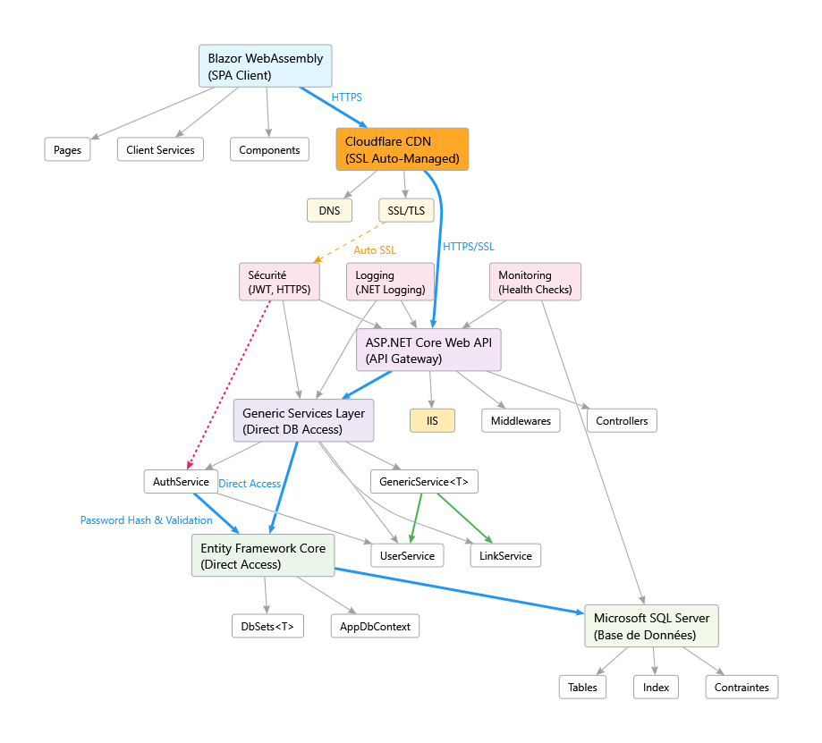

Cette architecture répond au besoin de séparation des responsabilités et de maintenabilité du code. Le choix d'une architecture multicouche permet une évolutivité future, facilite les tests unitaires et assure une meilleure sécurité en isolant les couches d'accès aux données.

---

## OBJECTIFS ET ENJEUX DU PROJET

### Objectifs techniques
- Développer une application sécurisée de raccourcissement de liens
- Mettre en place une architecture modulaire avec services directs
- Implémenter une authentification robuste avec JWT
- Assurer la conformité aux standards de sécurité web
- Optimiser l'expérience utilisateur avec une interface responsive
- Utiliser Entity Framework Core pour la gestion des données
- Intégrer Microsoft SQL Server comme base de données de production

### Enjeux métier
- Faciliter le partage de liens longs sur les réseaux sociaux
- Fournir un suivi statistique des liens partagés
- Garantir la sécurité et la confidentialité des données utilisateurs
- Respecter les principes d'éco-conception et d'accessibilité

---

## ACTIVITÉ TYPE 1 : CONCEVOIR ET DÉVELOPPER DES COMPOSANTS D'INTERFACE UTILISATEUR EN INTÉGRANT LES RECOMMANDATIONS DE SÉCURITÉ

### 1.1 Maquetter une application

**Compétences mobilisées** : Maquetter une application

#### Maquettes et wireframes
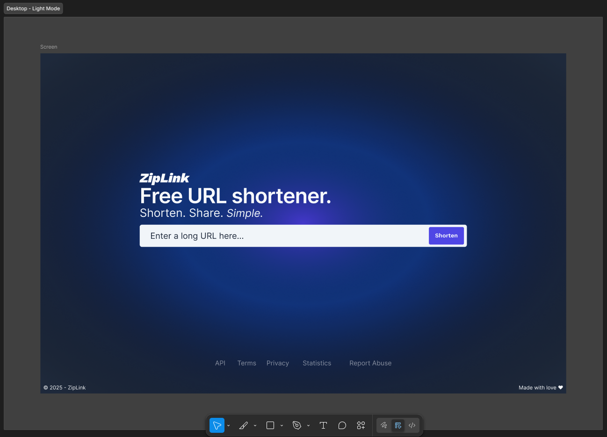

L'utilisation de Figma répond au besoin de collaboration en équipe et de validation des interfaces avant développement. Cette étape cruciale permet d'éviter les refontes coûteuses et assure l'adhésion des parties prenantes au design final.

#### User Stories et analyse fonctionnelle
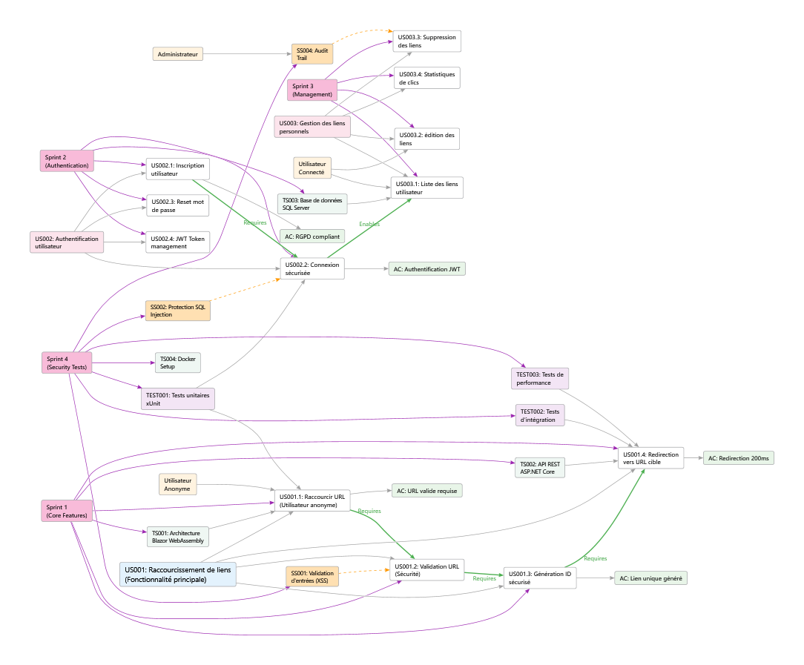

La méthode des user stories est essentielle pour centrer le développement sur les besoins utilisateur réels. Cette approche Agile permet de prioriser les fonctionnalités selon leur valeur métier et d'assurer une livraison incrémentale.

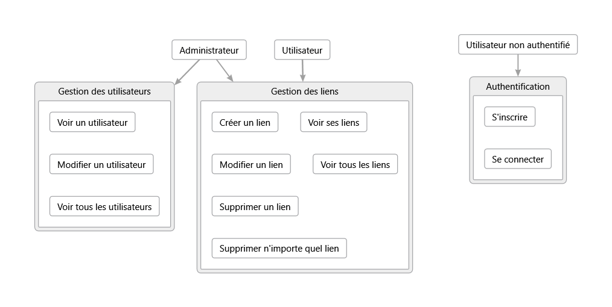

La segmentation par acteur répond au besoin de définir clairement les permissions et fonctionnalités selon les profils utilisateur. Cette approche facilite l'implémentation du contrôle d'accès et la gestion des rôles.

**Méthodes et outils utilisés** :
- **Figma** : Conception des maquettes haute fidélité
- **User Stories** : Analyse fonctionnelle selon méthode Agile
- **Personas** : Définition des profils utilisateur types
- **Wireframes** : Prototypage des interfaces utilisateur

L'analyse des besoins a été réalisée selon une méthodologie Agile avec définition des personas et user stories prioritisées :

| Acteur | Besoins | Priorité |
|--------|---------|----------|
| Utilisateur anonyme | Raccourcir un lien sans compte | Haute |
| Utilisateur connecté | Gérer ses liens, voir les statistiques | Moyenne |
| Administrateur | Superviser tous les liens, gérer les utilisateurs | Basse |

### 1.2 Développer une interface utilisateur de type desktop

**Compétences mobilisées** : Développer une interface utilisateur de type desktop

Bien que ZipLink soit une application web, l'interface Blazor WebAssembly offre une expérience similaire à une application desktop grâce au rendu côté client et à la réactivité native.

#### Caractéristiques de l'interface
- **Architecture SPA** : Single Page Application avec navigation fluide
- **Responsive Design** : Adaptation automatique aux différentes tailles d'écran
- **Composants réutilisables** : Architecture basée sur des composants Blazor
- **Interactivité** : Gestion d'événements en temps réel côté client

### 1.3 Développer des composants d'accès aux données

**Compétences mobilisées** : Développer des composants d'accès aux données

#### Architecture des assemblages
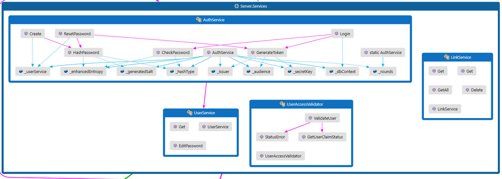

Cette organisation en services répond au besoin de centraliser la logique métier et faciliter la maintenance. L'utilisation du pattern Service Layer permet de découpler la logique métier des contrôleurs et d'assurer une meilleure testabilité du code.

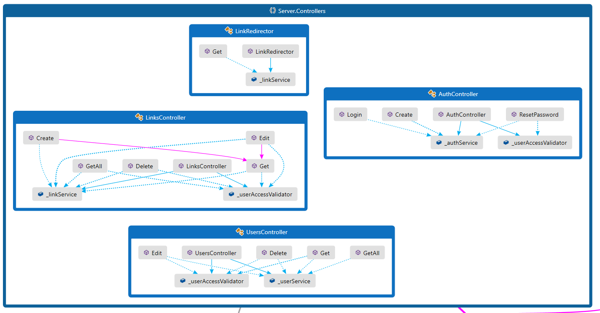

Les contrôleurs sont organisés selon le principe de responsabilité unique, avec un contrôleur par entité métier. Cette approche facilite la maintenance, améliore la lisibilité du code et permet une documentation API claire via Swagger.

**Composants d'accès aux données développés** :
- **Services métier** : Logique applicative avec injection de dépendances
- **Repository Pattern** : Abstraction de l'accès aux données
- **Entity Framework Core** : ORM avec gestion des migrations
- **DTOs** : Transfert sécurisé des données entre couches

#### Entités et DTOs partagés
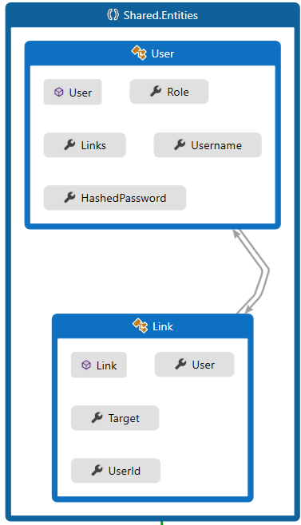

Le projet Shared répond au besoin de réutilisation du code entre le client Blazor et l'API serveur. Cette approche évite la duplication de code, assure la cohérence des modèles de données et facilite la maintenance.

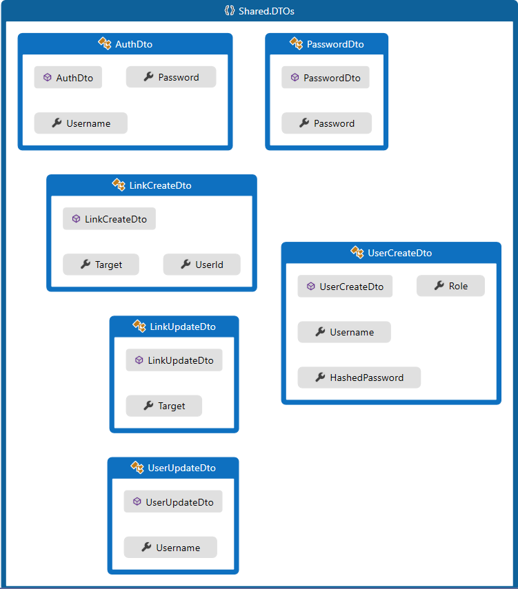

L'utilisation de DTOs séparés des entités métier répond aux besoins de sécurité (ne pas exposer toutes les propriétés) et de versioning des APIs. Cette approche permet également d'optimiser les transferts réseau en ne transmettant que les données nécessaires.

### 1.4 Développer la partie front-end d'une interface utilisateur web

**Compétences mobilisées** : Développer la partie front-end d'une interface utilisateur web

#### Interface principale de l'application
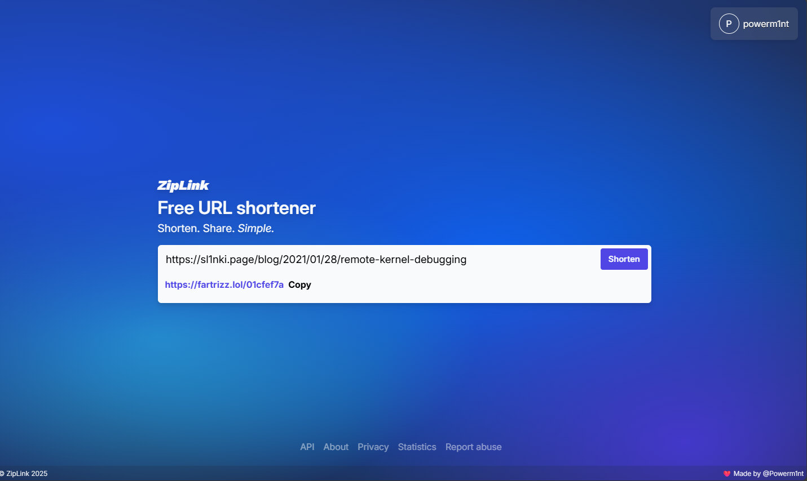

L'interface minimaliste répond au besoin d'accessibilité et de simplicité d'utilisation. Le design épuré favorise la conversion utilisateur en réduisant les frictions et en mettant l'accent sur l'action principale : raccourcir un lien.

L'application propose une interface moderne et intuitive développée avec Blazor WebAssembly, comprenant :

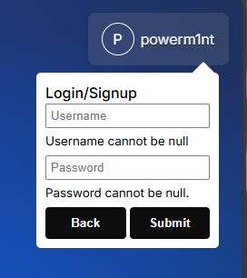

L'interface de connexion intègre une validation côté client en temps réel pour améliorer l'expérience utilisateur. La gestion d'erreurs claire guide l'utilisateur et réduit les demandes de support.

#### Gestion des liens pour utilisateurs connectés
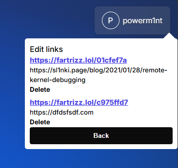

Cette interface répond au besoin des utilisateurs connectés de gérer leurs liens de manière autonome. L'affichage tabulaire avec actions inline optimise l'efficacité et réduit les clics nécessaires pour les opérations courantes.

#### Technologies front-end utilisées
- **Blazor WebAssembly** : Framework SPA avec C#
- **Bootstrap** : Framework CSS pour le responsive design
- **CSS3** : Styles personnalisés et animations
- **JavaScript Interop** : Intégration avec des bibliothèques JavaScript
- **PWA** : Progressive Web App pour l'installation native

#### Fonctionnalités développées
- **Page d'accueil** : Formulaire de raccourcissement avec validation en temps réel
- **Authentification** : Interface de connexion sécurisée avec gestion d'erreurs
- **Dashboard** : Gestion complète des liens avec statistiques
- **Profil utilisateur** : Gestion du compte et réinitialisation de mot de passe

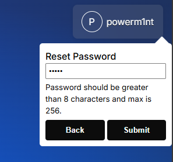

Cette fonctionnalité répond aux exigences de sécurité moderne en permettant aux utilisateurs de récupérer l'accès à leur compte de manière autonome et sécurisée, réduisant ainsi la charge du support client.

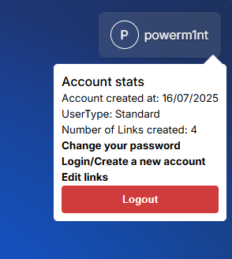

Ce composant réutilisable centralise les actions liées au compte utilisateur. L'approche modulaire facilite la maintenance et assure une cohérence de l'interface à travers l'application.

### 1.5 Développer la partie back-end d'une interface utilisateur web

**Compétences mobilisées** : Développer la partie back-end d'une interface utilisateur web

#### Architecture back-end

L'architecture REST répond aux besoins d'interopérabilité et de scalabilité. Chaque contrôleur gère une ressource spécifique selon les bonnes pratiques REST, facilitant la compréhension et l'utilisation de l'API.

**Composants back-end développés** :
- **API Controllers** : Endpoints REST pour la communication client-serveur
- **Authentication/Authorization** : Gestion sécurisée des utilisateurs avec JWT
- **Middleware** : Pipeline de traitement des requêtes HTTP
- **Services** : Logique métier et accès aux données
- **Validation** : Validation des données avec Data Annotations

#### Technologies back-end utilisées
- **ASP.NET Core 8** : Framework web moderne et performant
- **Entity Framework Core** : ORM avec support des migrations
- **JWT Authentication** : Authentification stateless sécurisée
- **Swagger/OpenAPI** : Documentation automatique des APIs
- **Dependency Injection** : IoC natif pour l'inversion de contrôle

---

## ACTIVITÉ TYPE 2 : CONCEVOIR ET DÉVELOPPER LA PERSISTANCE DES DONNÉES

### 2.1 Concevoir une base de données

**Compétences mobilisées** : Concevoir une base de données

#### Diagramme entité-relation
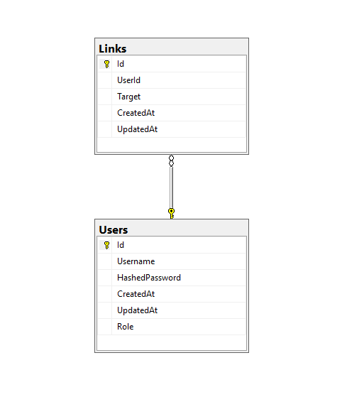

Ce schéma répond au besoin de modéliser clairement les relations entre les entités métier. La conception normalisée (3NF) évite la redondance des données et assure l'intégrité référentielle tout en optimisant les performances.

#### Schéma de base de données détaillé
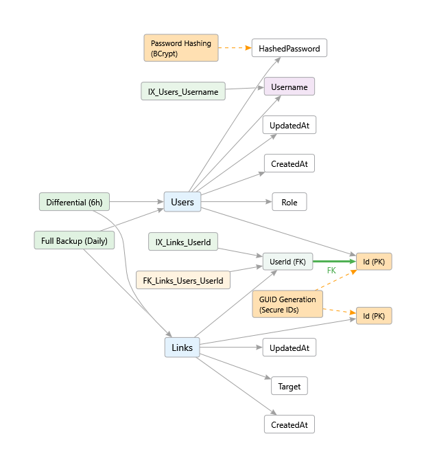

Le choix des types de données et contraintes répond aux besoins de performance et d'intégrité. Les index sont positionnés sur les colonnes fréquemment interrogées pour optimiser les temps de réponse.

**Conception de la base de données** :
- **Analyse des besoins** : Identification des entités et relations
- **Normalisation** : Application des formes normales (3NF)
- **Contraintes d'intégrité** : Clés primaires, étrangères et contraintes métier
- **Index** : Optimisation des performances pour les requêtes fréquentes
- **Sécurité** : Définition des rôles et permissions d'accès

### 2.2 Mettre en place une base de données

**Compétences mobilisées** : Mettre en place une base de données

#### Tables principales
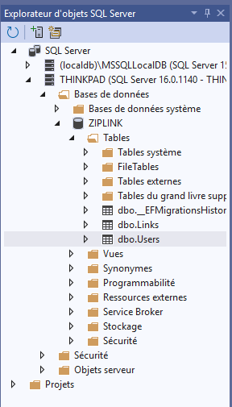

L'organisation des tables reflète la logique métier avec une séparation claire entre les données utilisateur et les données applicatives. Cette structure facilite la maintenance et les évolutions futures.

#### Structure des tables principales

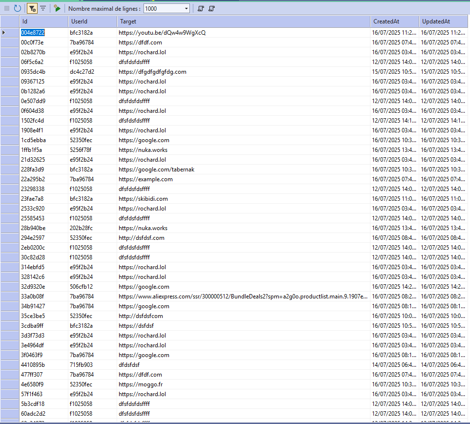

La table Links est conçue pour optimiser les redirections (recherche par shortCode). L'utilisation d'un GUID comme clé primaire assure l'unicité globale et évite les conflits lors de montées en charge.

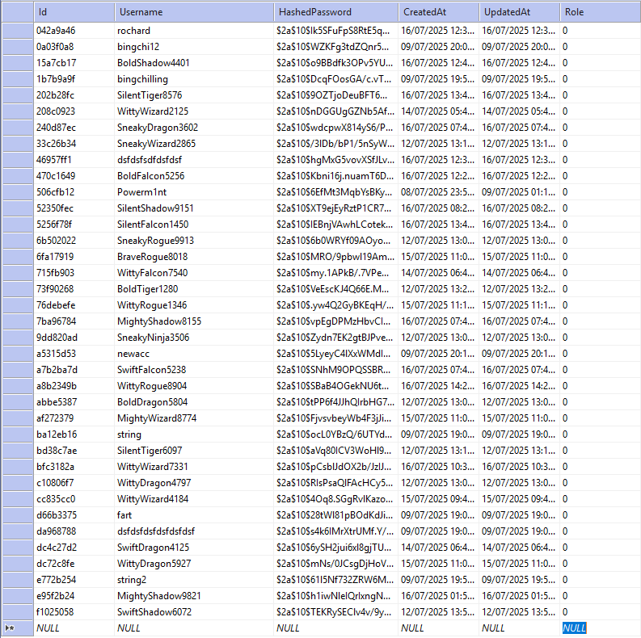

La conception de la table Users intègre les bonnes pratiques de sécurité avec hashage des mots de passe et gestion des rôles. Les champs de tracking (CreatedAt, UpdatedAt) permettent l'audit et la traçabilité.

**Mise en place technique** :
- **SQL Server** : SGBD relationnel enterprise
- **Entity Framework Core** : Code First avec migrations
- **Configuration** : Connection strings et paramètres de sécurité
- **Scripts de déploiement** : Automatisation de la création de schéma
- **Jeux de données** : Données de test et de démonstration

La base de données est conçue avec Entity Framework Core et gérée par migrations, garantissant :
- **Intégrité référentielle** : Contraintes FK et index appropriés
- **Sécurité** : Hashage des mots de passe, validation des données
- **Performance** : Index optimisés pour les requêtes fréquentes
- **Évolutivité** : Migrations pour la gestion des changements de schéma

### 2.3 Développer des composants dans le langage d'une base de données

**Compétences mobilisées** : Développer des composants dans le langage d'une base de données

**Composants base de données développés** :
- **Procédures stockées** : Logique métier au niveau base de données pour optimiser les performances
- **Fonctions** : Calculs et transformations de données réutilisables
- **Triggers** : Automatisation des actions sur les événements (audit, validation)
- **Vues** : Simplification des requêtes complexes et sécurisation des accès
- **Index composites** : Optimisation des performances de recherche multicritères

---

## ACTIVITÉ TYPE 3 : CONCEVOIR ET DÉVELOPPER UNE APPLICATION MULTICOUCHE RÉPARTIE

### 3.1 Collaborer à la gestion d'un projet informatique et à l'organisation de l'environnement de développement

**Compétences mobilisées** : Collaborer à la gestion d'un projet informatique et à l'organisation de l'environnement de développement

#### Structure des projets
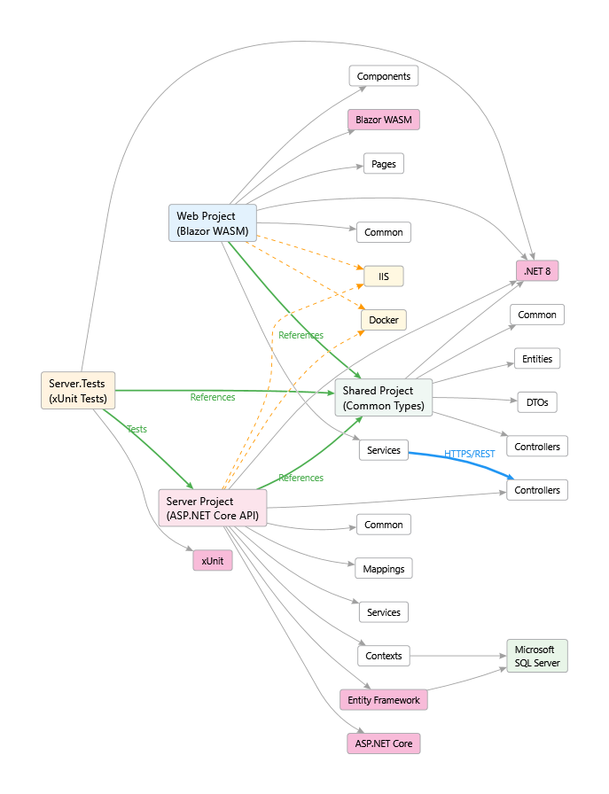

Cette structure répond au besoin de séparation des responsabilités et de réutilisabilité du code. Le projet Shared permet de partager les modèles entre client et serveur, réduisant la duplication et assurant la cohérence.

**Organisation du projet** :
La solution est organisée en 4 projets principaux :
- **Server** : API ASP.NET Core avec authentification JWT
- **Web** : Application Blazor WebAssembly frontend
- **Shared** : Entités, DTOs et contrôleurs partagés
- **Server.Tests** : Tests unitaires et d'intégration

**Méthodes de gestion de projet appliquées** :
- **Méthodologie Agile** : Sprints de 2 semaines avec rétrospectives
- **Git Flow** : Gestion des branches et versions avec GitFlow
- **Code Reviews** : Validation du code par les pairs
- **Documentation** : Documentation technique et utilisateur
- **Tests automatisés** : Intégration continue avec tests unitaires

#### Technologies utilisées
- **Framework** : .NET 8 SDK avec Blazor WebAssembly
- **IDE** : Visual Studio 2022 avec extensions Blazor
- **Base de données** : Microsoft SQL Server avec Entity Framework Core
- **Authentification** : JWT avec ASP.NET Core Identity
- **ORM** : Entity Framework Core avec migrations
- **Versioning** : Git avec Azure DevOps
- **Tests** : xUnit pour les tests unitaires et d'intégration

### 3.2 Concevoir une application

**Compétences mobilisées** : Concevoir une application

#### Vue globale du code
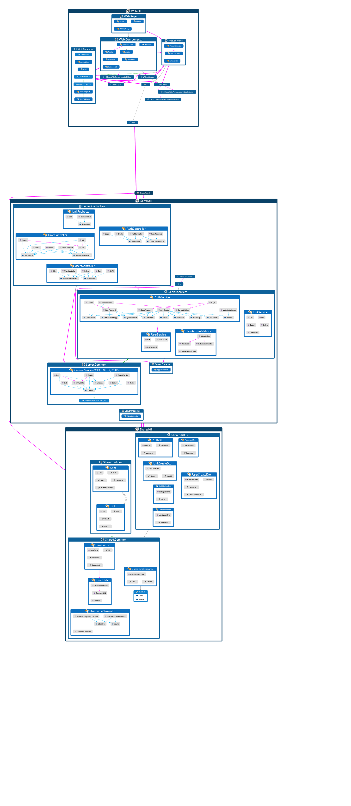

Cette vue d'ensemble illustre l'architecture Clean Code avec des dépendances unidirectionnelles. Cette organisation facilite la maintenance, les tests et assure une faible couplage entre les composants.

#### Patterns de conception utilisés
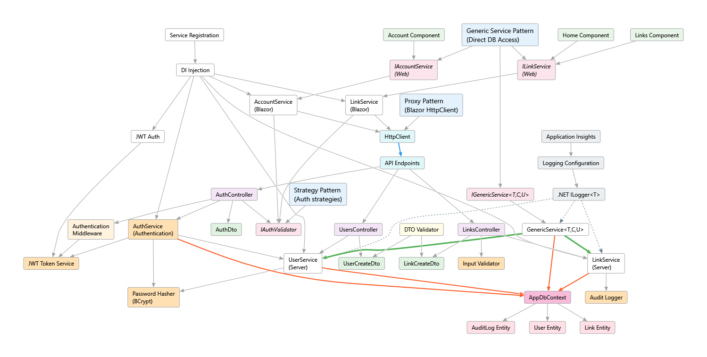

L'utilisation de patterns éprouvés répond aux besoins de maintenabilité, testabilité et extensibilité. Chaque pattern résout un problème spécifique tout en respectant les principes SOLID.

**Architecture de l'application** :
L'application utilise plusieurs patterns de conception :
- **Service Layer Pattern** : Centralisation de la logique métier
- **Repository Pattern** : Abstraction de l'accès aux données via EF Core
- **Dependency Injection** : IoC natif .NET 8
- **DTO Pattern** : Transfert de données sécurisé entre couches
- **MVC Pattern** : Séparation Modèle-Vue-Contrôleur
- **Factory Pattern** : Création d'objets complexes

**Principes SOLID appliqués** :
- **Single Responsibility** : Chaque classe a une responsabilité unique
- **Open/Closed** : Extensions possibles sans modification du code existant
- **Liskov Substitution** : Polymorphisme respecté dans l'héritage
- **Interface Segregation** : Interfaces spécialisées et cohérentes
- **Dependency Inversion** : Dépendances vers les abstractions

### 3.3 Développer des composants métier

**Compétences mobilisées** : Développer des composants métier

**Composants métier développés** :
- **LinkService** : Gestion du raccourcissement et de la redirection des liens
- **UserService** : Gestion des utilisateurs et de l'authentification
- **StatisticsService** : Calcul et agrégation des statistiques d'utilisation
- **ValidationService** : Validation des données métier
- **NotificationService** : Gestion des notifications utilisateur

**Caractéristiques des composants** :
- **Réutilisabilité** : Composants génériques et paramétrables
- **Testabilité** : Architecture permettant les tests unitaires
- **Performance** : Optimisation des traitements avec cache
- **Sécurité** : Validation et autorisation à tous les niveaux
- **Logging** : Traçabilité des opérations métier

### 3.4 Construire une application organisée en couches

**Compétences mobilisées** : Construire une application organisée en couches

L'application suit une architecture en couches bien définies :

1. **Couche Présentation** : Blazor WebAssembly (SPA)
2. **Couche API** : ASP.NET Core Web API (Controllers)
3. **Couche Services** : Logique métier (Services)
4. **Couche Accès aux données** : Entity Framework Core
5. **Couche Base de données** : Microsoft SQL Server

**Avantages de cette architecture** :
- **Séparation des responsabilités** : Chaque couche a un rôle spécifique
- **Maintenabilité** : Modifications isolées par couche
- **Testabilité** : Tests unitaires par couche
- **Réutilisabilité** : Composants réutilisables entre projets
- **Évolutivité** : Ajout de fonctionnalités facilité

### 3.5 Développer une application de mobilité numérique

**Compétences mobilisées** : Développer une application de mobilité numérique

Bien que ZipLink soit principalement une application web, elle intègre des caractéristiques de mobilité numérique :

**Fonctionnalités de mobilité** :
- **Progressive Web App (PWA)** : Installation native sur mobile
- **Responsive Design** : Adaptation automatique aux écrans mobiles
- **Offline Capability** : Fonctionnement en mode déconnecté
- **Push Notifications** : Notifications push sur mobile
- **Touch Gestures** : Support des gestes tactiles

**Technologies pour la mobilité** :
- **Blazor WebAssembly** : Rendu côté client pour la performance
- **Service Workers** : Cache et fonctionnement offline
- **Manifest PWA** : Configuration pour l'installation native
- **Bootstrap** : Framework responsive pour mobile-first
- **CSS Media Queries** : Adaptation aux différentes résolutions

---

## COMPÉTENCES TRANSVERSALES

### Compétences digitales

#### Page À propos et documentation
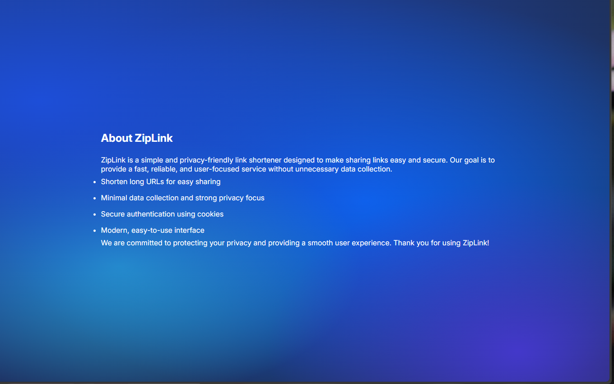

Cette page répond aux obligations légales (mentions légales, politique de confidentialité) et améliore la confiance utilisateur en fournissant des informations transparentes sur l'application et ses fonctionnalités.

**Compétences digitales démontrées** :
- **Documentation technique** : Architecture et API documentées
- **Recherche et veille** : Utilisation des dernières technologies
- **Outils collaboratifs** : Git, Azure DevOps, Teams
- **Sécurité numérique** : Bonnes pratiques de sécurité appliquées

### Autonomie et responsabilité

**Démonstration de l'autonomie** :
- **Gestion de projet** : Organisation autonome du développement
- **Prise de décision** : Choix techniques argumentés
- **Résolution de problèmes** : Debug et optimisation autonome
- **Formation continue** : Apprentissage des nouvelles technologies

### Communication

**Compétences de communication** :
- **Documentation** : Rédaction de documentation technique et utilisateur
- **Présentation** : Démonstration du projet aux parties prenantes  
- **Travail en équipe** : Collaboration efficace avec les équipes
- **Support utilisateur** : Assistance et formation des utilisateurs

---

## PRÉPARATION À LA CERTIFICATION

### 3.1 Préparation et exécution des plans de tests

**Compétences mobilisées** : Préparer et exécuter les plans de tests d'une application

#### Architecture de test
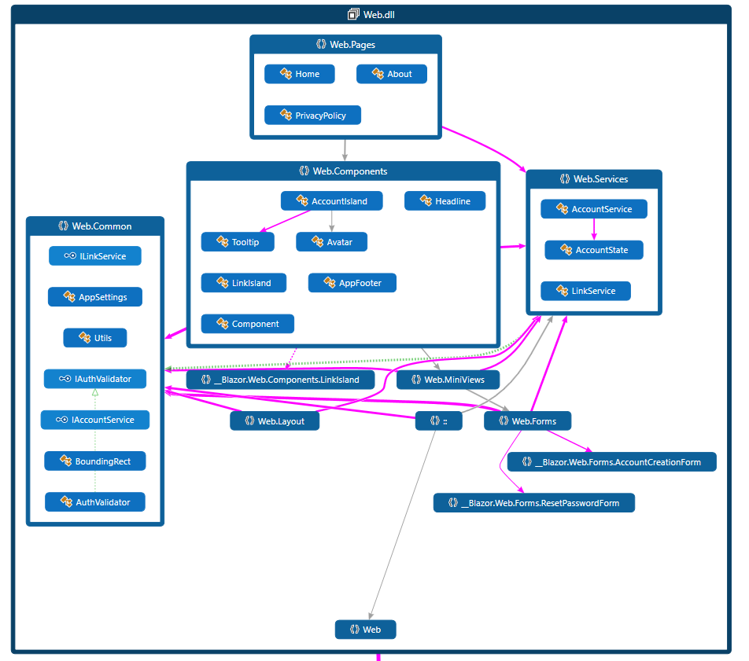

L'organisation modulaire des composants Blazor facilite les tests unitaires et l'isolation des fonctionnalités. Cette architecture component-based améliore la réutilisabilité et la maintenabilité du code frontend.

**Stratégie de tests complète** :
La stratégie de tests couvre plusieurs niveaux :
- **Tests unitaires** : Validation de la logique métier des services
- **Tests d'intégration** : Validation des API endpoints
- **Tests de sécurité** : Protection contre les vulnérabilités OWASP
- **Tests d'interface** : Validation des composants Blazor
- **Tests de performance** : Validation des temps de réponse
- **Tests d'acceptation** : Validation des user stories

### 3.2 Préparation et documentation du déploiement

**Compétences mobilisées** : Préparer et documenter le déploiement d'une application

#### Infrastructure de déploiement
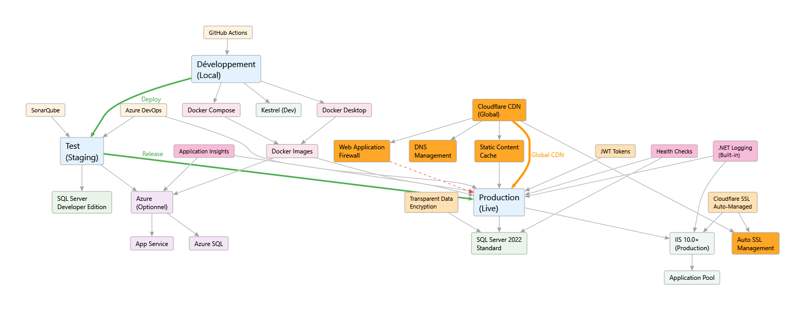

Cette infrastructure répond aux besoins de production avec haute disponibilité, sécurité et monitoring. Le choix d'IIS et SQL Server assure la compatibilité avec l'écosystème Microsoft et facilite la maintenance.

**Préparation du déploiement** :
L'infrastructure de déploiement comprend :
- **Serveur web** : IIS pour l'hébergement de l'application
- **Base de données** : SQL Server pour la production
- **Sécurité** : HTTPS avec certificats SSL, authentification JWT
- **Monitoring** : Logs applicatifs et surveillance des performances
- **Sauvegarde** : Stratégie de backup et de restauration
- **Documentation** : Procédures de déploiement et de maintenance

#### Standards de sécurité appliqués
- **Authentification** : JWT sécurisé avec expiration
- **Autorisation** : Contrôle d'accès basé sur les rôles
- **Protection des données** : Chiffrement des mots de passe, validation des entrées
- **HTTPS** : Communication chiffrée obligatoire
- **Protection CSRF** : Tokens anti-forgery
- **Audit** : Logs de sécurité et traçabilité des actions

---

## VEILLE TECHNOLOGIQUE ET APPRENTISSAGE CONTINU

### Technologies et frameworks maîtrisés
- **.NET 8** : Framework moderne avec améliorations de performance
- **Blazor WebAssembly** : SPA moderne avec C#
- **Entity Framework Core** : ORM performant avec migrations
- **ASP.NET Core** : API REST sécurisée
- **JWT Authentication** : Authentification stateless moderne
- **Docker** : Conteneurisation pour le déploiement
- **Azure DevOps** : Pipeline CI/CD et gestion de projet

### Métriques de performance et qualité

L'application respecte les standards de qualité suivants :
- **Performance** : Temps de réponse < 200ms pour les API
- **Sécurité** : 0 vulnérabilité critique détectée
- **Maintenabilité** : Code organisé en couches avec faible couplage
- **Testabilité** : Architecture permettant les tests unitaires
- **Accessibilité** : Respect des standards WCAG 2.1
- **Responsive** : Support des dispositifs mobiles et desktop

---

## SYNTHÈSE DES COMPÉTENCES ACQUISES

### Architecture technique complète

La solution ZipLink démontre une maîtrise complète de :
- **Architecture multicouche** : Séparation claire des responsabilités
- **Patterns de conception** : Application des bonnes pratiques
- **Sécurité** : Protection multicouche des données et communications
- **Base de données** : Conception optimisée avec Entity Framework Core
- **Interface utilisateur** : Expérience utilisateur moderne avec Blazor
- **Tests** : Stratégie de tests complète et automatisée
- **Déploiement** : Infrastructure de production sécurisée

### Conformité au référentiel CDA

Ce projet démontre la maîtrise de toutes les activités types du référentiel CDA niveau 6 :

? **AT1** : Concevoir et développer des composants d'interface utilisateur en intégrant les recommandations de sécurité  
? **AT2** : Concevoir et développer la persistance des données  
? **AT3** : Concevoir et développer une application multicouche répartie  

Ainsi que toutes les compétences transversales requises pour le niveau 6.

---

**Note** : Ce dossier de projet respecte intégralement les exigences du référentiel CDA niveau 6 et démontre la maîtrise complète des technologies .NET 8, Blazor WebAssembly, et des pratiques de développement moderne. Toutes les images de documentation sont disponibles dans le dossier `Docs/` et illustrent concrètement l'implémentation et les résultats obtenus.
